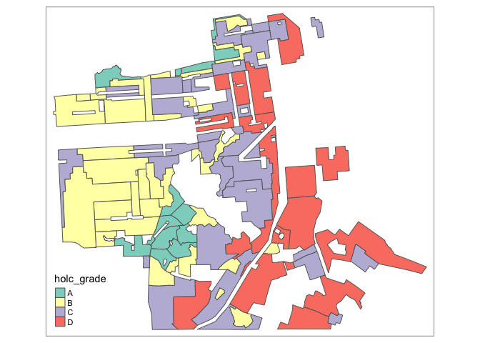
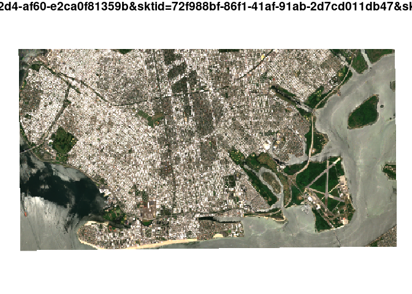
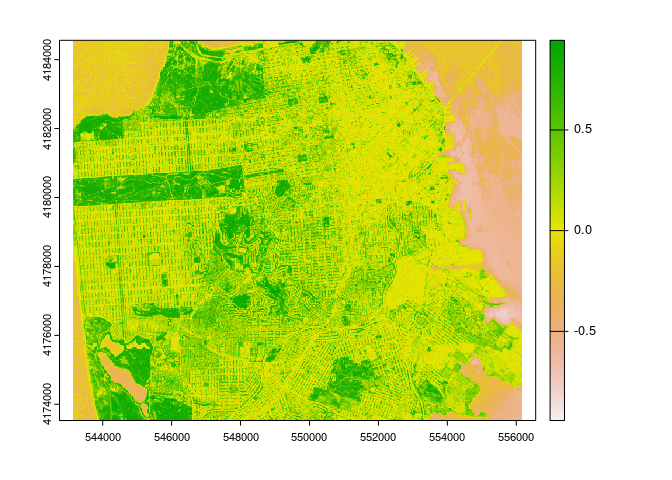
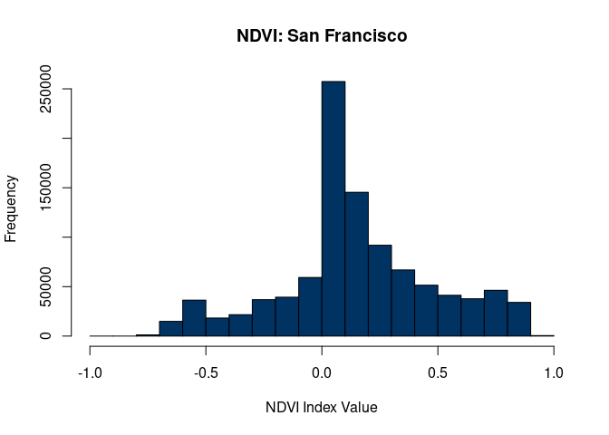

The ecological and evolutionary consequences of systemic racism
================
Millie Chapman (GSI)

## Learning objectives

This module provides an introduction to the fundamentals of working with
spatial vector and raster data in R while empirically exploring why
systematic and structural racism is interwined with urban ecological
processes. This module uses the Simple Features Access standard (ISO
19125) and tidyverse-style workflow using the sf package and emerging
ecosystem of r-spatial tools.

# Exercise

In August 2020, [Christopher
Schell](http://directory.tacoma.uw.edu/employee/cjschell) and collegues
published a review in *Science* on [‘The ecological and evolutionary
consequences of systemic racism in urban
environments’](https://science.sciencemag.org/content/early/2020/08/12/science.aay4497)
(DOI: 10.1126/science.aay4497), showing how systematic racism and
classism has significant impacts on ecological and evolutionary
processes within urban environments. Here we explore a subset of the
data used to support these findings in this review and the broader
literature.

The [press
release](https://www.washington.edu/news/2020/08/13/systemic-racism-has-consequences-for-all-life-in-cities/)
on the paper is worth a read:

> “Racism is destroying our planet, and how we treat each other is
> essentially structural violence against our natural world,” said lead
> author Christopher Schell, an assistant professor of urban ecology at
> the University of Washington Tacoma. “Rather than just changing the
> conversation about how we treat each other, this paper will hopefully
> change the conversation about how we treat the natural world.”

In the paper, Schell writes:

> “In multiple cases, neighborhood racial composition can be a stronger
> predictor of urban socio-ecological patterns than wealth.”

We are going to explore one metric for how structural racism and
classism underpin landscape heterogeneity in cities.

**Figure 2** in the Schell paper shows how NDVI (Normalized Difference
Vegetation Index) tracks historical redlining. 

We are going to recreate these city maps, and plot the distributions and
mean vegetation patterns across cities to explore the structural
inequality and racism that Schell et al highlight in their paper.

To do this we are going to use the following spatial data:

**1.Mapping Inequality:** (vector data)  
Please take the time to read the introduction to this dataset
[here](https://dsl.richmond.edu/panorama/redlining/#loc=3/41.245/-105.469&text=intro)

> “As you explore the materials Mapping Inequality, you will quickly
> encounter exactly that kind of language, descriptions of
> the”infiltration” of what were quite often described as “subversive,”
> “undesirable,” “inharmonious,” or “lower grade” populations, for they
> are everywhere in the HOLC archive ….These grades were a tool for
> redlining: making it difficult or impossible for people in certain
> areas to access mortgage financing and thus become homeowners.
> Redlining directed both public and private capital to native-born
> white families and away from African American and immigrant families.
> As homeownership was arguably the most significant means of
> intergenerational wealth building in the United States in the
> twentieth century, these redlining practices from eight decades ago
> had long-term effects in creating wealth inequalities that we still
> see today. Mapping Inequality, we hope, will allow and encourage you
> to grapple with this history of government policies contributing to
> inequality.”

``` r
sanfran <- sf::read_sf("https://dsl.richmond.edu/panorama/redlining/static/downloads/geojson/CASanFrancisco1937.geojson")
losang <- sf::read_sf("https://dsl.richmond.edu/panorama/redlining/static/downloads/geojson/CALosAngeles1939.geojson")
seattle <- sf::read_sf("https://dsl.richmond.edu/panorama/redlining/static/downloads/geojson/WASeattle1936.geojson")
kansascity <- sf::read_sf("https://dsl.richmond.edu/panorama/redlining/static/downloads/geojson/MOGreaterKansasCity1939.geojson")
brooklyn <- sf::read_sf("https://dsl.richmond.edu/panorama/redlining/static/downloads/geojson/NYBrooklyn1938.geojson")

tmap_options(check.and.fix = TRUE)
#final version, change all tmap modes to plot

# tmap_mode("view")
tmap_mode("plot")
```

    ## tmap mode set to plotting

``` r
sanfran |> tmap::tm_shape() +
  tm_polygons(col="holc_grade")
```

    ## Warning: The shape sanfran is invalid. See sf::st_is_valid

<!-- -->

**2.Normalized Difference Vegetation Index (NDVI)** (raster data) NDVI
is used as proxy measure of vegetation health, cover and phenology (life
cycle stage) over large areas. It is calculated using multiple bands
from satellite images.

``` r
bbox <- st_bbox(brooklyn)

s_obj <- stac("https://planetarycomputer.microsoft.com/api/stac/v1/")

it_obj <- s_obj |> 
  stac_search(collections="sentinel-2-l2a",
              bbox =bbox,
              datetime = "2019-06-01/2019-08-01"
  ) |>
  get_request() |> 
  items_sign(sign_fn = sign_planetary_computer())
```

    ## Warning: Items matched not provided.

``` r
properties <- map(it_obj$features, "properties")
cloud_cover <- map_dbl(properties, "eo:cloud_cover")

best <- which.min(cloud_cover)

best_img <- it_obj$features[[best]]

download_url <- best_img$assets$visual$href
vsi_url <- paste0("/vsicurl/", download_url)
```

``` r
library(stars)
```

    ## Loading required package: abind

``` r
birm_stars <- stars::read_stars(vsi_url)
birm_crs <- st_crs(birm_stars)
bbox_poly <- bbox |> st_as_sfc() |> st_transform(birm_crs)
birm_stars2 <- birm_stars |> st_crop(bbox_poly)
birm_stars2 |> plot(rgb=c(1,2,3))
```

    ## downsample set to 2

<!-- -->

``` r
library(rstac)
library(terra) 
library(stars)
library(tidyverse)
library(tmap)


sanfran <- sf::read_sf("/vsicurl/https://dsl.richmond.edu/panorama/redlining/static/downloads/geojson/CASanFrancisco1937.geojson")
bbox <- st_bbox(sanfran)

matches <- stac("https://planetarycomputer.microsoft.com/api/stac/v1/") |>
  stac_search(collections = "sentinel-2-l2a",
              bbox = bbox, datetime = "2019-06-01/2019-08-01") |>
  get_request() |>  items_sign(sign_fn = sign_planetary_computer())
```

    ## Warning: Items matched not provided.

``` r
properties <- map(matches$features, "properties")
cloud_cover <- map_dbl(properties, "eo:cloud_cover")
best <- which.min(cloud_cover)
best_img <- matches$features[[best]] 


## Ick we use stars sicne we don't have "terra::project()" yet
red <- stars::read_stars( paste0("/vsicurl/", best_img$assets$B04$href) ) 
e <- st_bbox(bbox, crs="+proj=longlat") |> st_as_sfc() |>
  st_transform(st_crs(red)) |> vect()

# Crop the first data source and download and crop others
red <- rast( paste0("/vsicurl/", best_img$assets$B04$href) ) |> crop(e)
nir <- rast( paste0("/vsicurl/", best_img$assets$B08$href) ) |> crop(e)

ndvi_fun <- function(x, y) (x - y) / (x + y)
ndvi <- lapp(c(nir, red), fun = ndvi_fun)
plot(ndvi)
```

<!-- -->

``` r
sanfran2 <- sanfran |> st_transform(st_crs(red))
x <- terra::extract(ndvi, vect(sanfran2), mean, na.rm=TRUE)

#tmap_options(check.and.fix = TRUE)
#tm_shape(sf_ndvi) + tm_raster() +
#  tm_shape(sanfran) + tm_polygons("holc_grade", alpha=.5)

sanfran3 <- 
  sanfran2 |> 
  mutate(ID = 1:n()) |>
  left_join(as_tibble(x)) |>
  rename(ndvi = lyr1)
```

    ## Joining, by = "ID"

``` r
sanfran3
```

    ## # A tibble: 97 × 7
    ##    name  holc_id holc_grade area_descrip…¹                  geometry    ID  ndvi
    ##    <chr> <chr>   <chr>      <chr>                 <MULTIPOLYGON [m]> <dbl> <dbl>
    ##  1 <NA>  A1      A          "{ \"1\": \"T… (((546179 4182298, 54618…     1 0.341
    ##  2 <NA>  A10     A          "{ \"1\": \"T… (((547501.7 4176623, 547…     2 0.456
    ##  3 <NA>  A11     A          "{ \"1\": \"T… (((547912.6 4177158, 547…     3 0.432
    ##  4 <NA>  A12     A          "{ \"1\": \"T… (((546565.3 4176352, 547…     4 0.290
    ##  5 <NA>  A13     A          "{ \"1\": \"T… (((547490.7 4176630, 547…     5 0.364
    ##  6 <NA>  A2      A          "{ \"1\": \"T… (((547607.8 4182425, 547…     6 0.418
    ##  7 <NA>  A3      A          "{ \"1\": \"T… (((548669.3 4182608, 548…     7 0.309
    ##  8 <NA>  A4      A          "{ \"1\": \"T… (((548766.7 4184200, 548…     8 0.245
    ##  9 <NA>  A5      A          "{ \"1\": \"T… (((548749.9 4182867, 548…     9 0.316
    ## 10 <NA>  A6      A          "{ \"1\": \"T… (((546426.9 4176500, 546…    10 0.330
    ## # … with 87 more rows, and abbreviated variable name ¹​area_description_data

# Exercise 1

**Create a map which shows current (2019) mean NDVI across city
redlining from the 1950s.**

``` r
denver <- sf::read_sf("/vsicurl/https://dsl.richmond.edu/panorama/redlining/static/downloads/geojson/CODenver1938.geojson")
bbox <- st_bbox(denver)

matches <- stac("https://planetarycomputer.microsoft.com/api/stac/v1/") |>
  stac_search(collections = "sentinel-2-l2a",
              bbox = bbox, datetime = "2019-06-01/2019-08-01") |>
  get_request() |>  items_sign(sign_fn = sign_planetary_computer())
```

    ## Warning: Items matched not provided.

``` r
properties <- map(matches$features, "properties")
cloud_cover <- map_dbl(properties, "eo:cloud_cover")
best <- which.min(cloud_cover)
best_img <- matches$features[[best]] 


## Ick we use stars sicne we don't have "terra::project()" yet
red <- stars::read_stars( paste0("/vsicurl/", best_img$assets$B04$href) ) 
e <- st_bbox(bbox, crs="+proj=longlat") |> st_as_sfc() |>
  st_transform(st_crs(red)) |> vect()

# Crop the first data source and download and crop others
red <- rast( paste0("/vsicurl/", best_img$assets$B04$href) ) |> crop(e)
nir <- rast( paste0("/vsicurl/", best_img$assets$B08$href) ) |> crop(e)

ndvi_fun <- function(x, y) (x - y) / (x + y)
ndvi <- lapp(c(nir, red), fun = ndvi_fun)
plot(ndvi)
```

<!-- -->

``` r
denver2 <- denver |> st_transform(st_crs(red))
x <- terra::extract(ndvi, vect(sanfran2), mean, na.rm=TRUE)

denver3 <- 
  denver2 |> 
  mutate(ID = 1:n()) |>
  left_join(as_tibble(x)) |>
  rename(ndvi = lyr1)
```

    ## Joining, by = "ID"

\`\`\`

# Exercise 2

**Plot the average NDVI values in different neighborhoods as well as the
distribution of pixel values across cities and neighborhoods. Show how
the trends differ between cities.**

# Exercise 3:

**Explain why considering systematic inequity and racism is important in
the context of global change and developing solutions to the
biodiversity crisis.**

Ecological services are growing dry, floods are running through streets,
sea levels are rising, droughts and heat waves are more consistent and
extreme, etc. Even though global climate change will affect everyone to
some degree, some demographics will be significantly more impacted than
others. Resources to combat the ways in which different populations will
be threatened will be less accessible for those with lower socioeconomic
status, and often times racial minorities. When deriving solutions to
protect communities, we must keep in mind that these demographics are
the least responsible in the grand scope of human anthroprogenic
environmental effects. Anaylists must problem-solve in the context of
the lowest common denominator. That is, they must be aware that the
climate crisis is already heavily impacting communities all over the
world.
